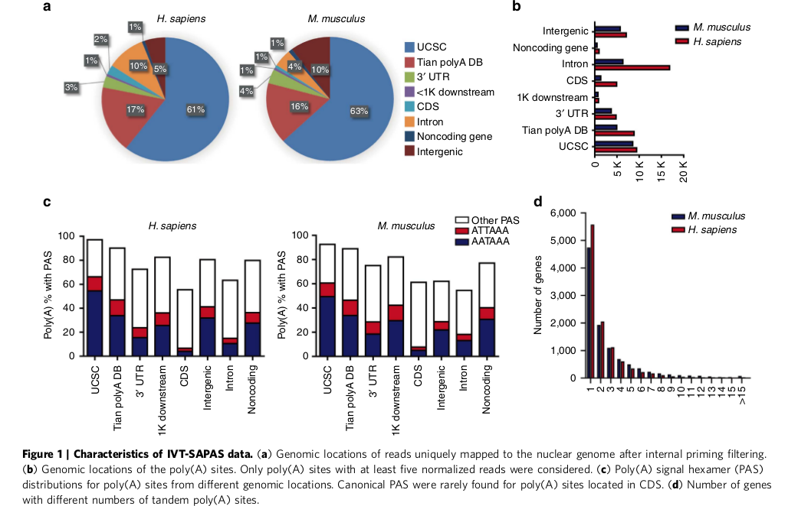

# The role of alternative polyadenylation in the antiviral innate immune response

[http://www.nature.com/articles/ncomms14605]

The shortening in 3'UTR (+ less expression of 3'
processing factors) in viral response (vesicular
stomatitis virus; VSV) is linked with the viral
replication.

Introduction
------------

### Alternative Polyadenylation 

**APA modifies protein**

* Function;
* Stability;
* Localization;
* Transational efficiency;

**How?** 3'UTR is a 'docking plataform' for RNA
binding proteins and microRNA

**Modification in 3' UTR length**
Lowering in the 3'UTR: cancer cells; cells in
proliferateion. Lengthening in 3'UTR: 
cell differentiation and nerves cells.

### Viral

**Receptors**

* Viral response Pattern-recognition recptors (PRR)
* cytosolic viral RNA sensing RIG-I-like recpetor (RLR); 
* + others (cGAS, IFI16, DDX41)

**Response** IFN1 cascade.

**Modulation*** transcriptional 'on' and 'off' switches;
alternative splicing; post-transcriptional regulation;

### Objectives

Explore global APA profile and to characterize the dynamic
APA-mediated regulation of antiviral responses.

**Technique** _In vitro_ transcription-sequencing APA sites (IVT-SAPAS).

Results
-------

### Transcriptome-wide analysis of the 3' end of mRNA

The samples:

* MDM: human monocyte-derived macrophages
* Mouse peritoneal macrophage
* Stomatitis virus (VSV)

**Quantification IFN-beta and RANTES** transcription
by qRT-PCR; secretion by ELISA; (RANTES = chemokine; IFN = type
of IFN1); _Both were found increased; sucessfull infection_

**Sequencing**

ORGANISM    | READS (mi)   | FILTER¹ | POLY(A) SITES²  | IN USCS + Tians
------------|-------------:|--------:|----------------:|------------------:
Human (MDM) | 258          | 90      | 53,697          | 34%
Mouse       | 564          | 181     | 31,820          | 42%

¹ - Mapping and removed internal primming

² - 5 or more __normalized__ reads

> The hexamers AAUAAA and AUUAAA (10-30 nt) is less used in CDSs!!!

** Occurence of APA ** Human: +-53% of the genes; Mouse: 32-45.4%;

**FIGURE 1**

### 3' UTR variation 
